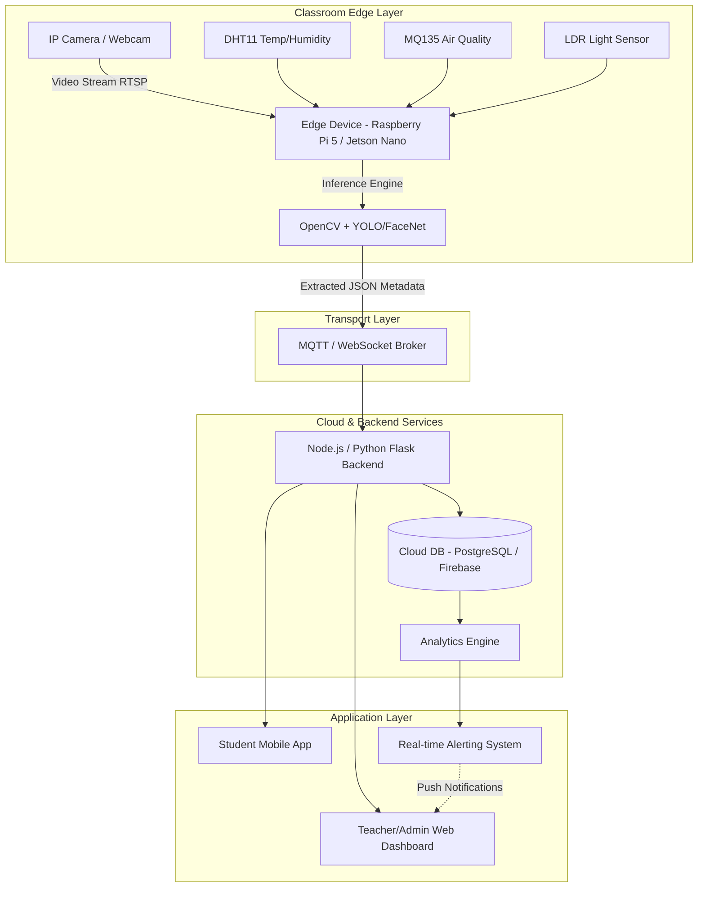
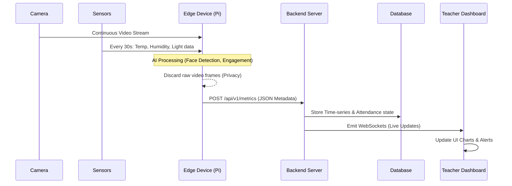

# Smart Classroom System: Production-Ready Project Document

## 1. Problem Definition

Traditional classroom management relies heavily on manual administrative tasks that detract from core educational objectives. The key problems identified in traditional setups include:

*   **Manual Attendance:** Roll calls or signing attendance sheets are time-consuming, prone to proxy attendance, and difficult to manage in large halls.
*   **Lack of Engagement Tracking:** Teachers cannot continuously monitor the attention levels of every student, making it hard to identify those who are struggling or disengaged.
*   **No Centralized Analytics:** Educators and administrators lack actionable, data-driven insights regarding class performance, attendance trends, and environment conditions.
*   **Poor Environment Monitoring:** Suboptimal lighting, high temperatures, or poor air quality can significantly reduce cognitive performance, yet these are rarely tracked in real-time.

---

## 2. System Architecture

The proposed system follows a scalable Edge-to-Cloud architectural pattern. Edge devices handle real-time vision processing to ensure low latency and preserve privacy, while the cloud handles analytics, storage, and cross-platform dashboards.

**Component Interaction Summary:**
1. IoT devices capture environmental context and visual fields.
2. The Edge node processes heavy video frames, identifying faces and emotions locally.
3. Lightweight meta-data (timestamp, student_id, emotion_score, attendance_status) is transmitted to the Cloud backend.
4. The Cloud persists data and serves it via an API to the React-based frontend and Android applications.

---

## 3. Features

*   **Face Recognition-Based Automatic Attendance:** Seamlessly tracks attendance as students walk in and sit down, updating the cloud database in real-time.
*   **Student Engagement Detection:** Uses Computer Vision to analyze posture, gaze, and facial expressions to compute real-time "engagement scores."
*   **Environment Monitoring:** Continuous tracking of temperature, humidity, light levels, and air quality index (AQI).
*   **Real-time Alerts:** Notifications sent to administrators/teachers if environmental conditions become hazardous or if the class average engagement drops below a threshold.
*   **Teacher Dashboard:** A central Web UI for educators to view daily attendance, aggregate class attention spans, and environmental health.
*   **Student Mobile App:** A dashboard for students to view their own attendance records, personalized performance insights, and schedules.

---

## 4. Technology Stack

### Computer Vision & Edge AI
*   **Image Processing:** OpenCV
*   **Object Detection (Posture/Phones):** YOLOv8 / YOLOv10 
*   **Face Recognition:** FaceNet / Dlib / Deepface
*   **Emotion Recognition:** Pre-trained CNN (ResNet-50 / VGG16 fine-tuned on FER-2013)

### Backend & Cloud
*   **Framework:** Python (FastAPI/Flask) or Node.js (Express)
*   **Real-time Messaging:** MQTT (Mosquitto) or WebSockets integrated via Socket.io
*   **Database:** Firebase Realtime DB / PostgreSQL (TimescaleDB for time-series sensor data)

### Frontend & Apps
*   **Web Dashboard:** React.js / Next.js with TailwindCSS (Premium UI/UX)
*   **Mobile App:** React Native or native Android (Kotlin)
*   **Data Visualization:** Chart.js, Recharts, or Grafana

---

## 5. Data Pipeline

**Workflow Highlights:**
*   **Ingestion:** Data is gathered at the edge.
*   **Transform & Compute:** Heaving lifting (Neural Network inference) occurs at the edge to extract metadata (e.g., `{'student_id': 102, 'emotion': 'attentive', 'timestamp': ...}`). Raw images are dropped.
*   **Storage & Action:** Clean metadata reaches the cloud where logic dictates if an alert needs to be triggered.

---

## 6. AI Models in Detail

1.  **Face Recognition Model (Attendance):**
    *   *Pipeline:* MTCNN (for face detection/alignment) $\rightarrow$ FaceNet (generates 128-d embeddings) $\rightarrow$ SVM / Cosine Similarity matching against the registered student database.
2.  **Emotion Detection Model:**
    *   *Pipeline:* Haar Cascades/MTCNN to isolate the face $\rightarrow$ CNN trained to output probability scores for emotions (Happy, Neutral, Confused, Drowsy).
3.  **Engagement Scoring System (Algorithm):**
    *   A composite index calculated using: `(Eye Contact Boolean * 0.4) + (Posture Boolean * 0.3) + (Positive/Neutral Emotion * 0.3)`. Output is mapped to a 0-100 scale.

---

## 7. Simulation Methodology (No Hardware Required)

To build and test this locally without buying Raspberry Pis or sensors, we will use software mockups:

*   **Camera Simulation:** Instead of an IP/CCTV camera, use the laptop's built-in webcam. In Python, this is executed natively via `cv2.VideoCapture(0)`.
*   **Vision Data Simulation:** Prerecorded class videos (from YouTube or a sample dataset) can be fed into `cv2.VideoCapture('sample_class.mp4')` to test multi-face scaling.
*   **Sensors Simulation:** Create a Python script (`sensor_mock.py`) that generates realistic mock data using random walks and Perlin noise for Temperature, AQI, and Light, publishing it to a local MQTT broker.
*   **Sample Datasets:** Use Kaggle datasets (e.g., LFW for faces, FER2013 for emotions) to pre-train or evaluate model accuracy locally.

---

## 8. Industry Use Cases

*   **K-12 Schools:** Automated administration and identification of bullying or extreme stress via sentiment analysis.
*   **Higher Education (Colleges/Universities):** Scaling attendance tracking for 300+ student lecture halls and analyzing lecture effectiveness based on aggregate engagement metrics.
*   **Corporate Training Rooms:** Assessing employee engagement during critical compliance or technical training sessions.
*   **Ed-Tech Platforms:** Hybrid learning models utilizing localized edge devices integrated into virtual classroom platforms.

---

## 9. Scalability Strategies

To transition from a prototype to a multi-classroom production deployment:

*   **Multi-Classroom Support:** Each Edge device is provisioned with a unique `classroom_id`. Data payloads use partition keys, allowing horizontal scaling of the database.
*   **Real-time Processing:** Shifting from HTTP POST polling to WebRTC/MQTT reduces network overhead, allowing simultaneous 100+ classroom ingestion streams per cloud server instance.
*   **Load Handling:** Deploy the Node.js backend inside Docker containers managed by Kubernetes (EKS/GKE). Auto-scaling policies adjust based on CPU load during peak hours (e.g., morning attendance rush).

---

## 10. Security & Privacy

Privacy is the most critical hurdle in classroom AI.
*   **Data Encryption:** All MQTT/HTTPs traffic is secured via TLS 1.2+. Data at rest in PostgreSQL relies on AES-256 encryption.
*   **Face Data Protection:** Raw video feeds and images are **never** transmitted to the cloud. Only mathematical vector embeddings (hashes) are stored. The original faces cannot be reverse-engineered from the cloud DB.
*   **Role-Based Access Control (RBAC):** Implementation of JWT (JSON Web Tokens). Students can only access their records; teachers can access their assigned classes; admins have root access.

---

## 11. Challenges & Solutions

| Challenge | Impact | Proposed Solution |
| :--- | :--- | :--- |
| **Variable Lighting** | Poor Face ID accuracy in dim rooms. | Use Histogram Equalization in OpenCV and rely on IR-enabled cameras for physical deployments. |
| **Occlusions & Masks** | Models fail if faces are partially hidden. | Retrain YOLO / FaceNet embeddings on masked-face datasets. Use posture tracking as a fallback. |
| **Network Latency** | Web dashboard delays. | 100% of video inference is pushed to the Edge (Raspberry Pi/Jetson). Only KB-sized JSON goes to the cloud. |
| **Privacy Pushback** | Legal/parental concerns. | Strict "No-Image-Saved" policy. Opt-in models and anonymization of engagement data for general analytics. |

---

## 12. Future Enhancements

*   **AI Virtual Tutor:** Integration with LLMs (like GPT-4/Claude) where the system identifies a confused student and prompts a tablet-based AI tutor to offer specialized help material on the current topic.
*   **Personalized Learning Paths:** Linking engagement metrics directly to quiz outcomes to recommend specific study patterns.
*   **Voice Assistant Integration:** Ambient microphone arrays tracking keyword frequency to determine the type of class interaction (lecture vs. active discussion).
